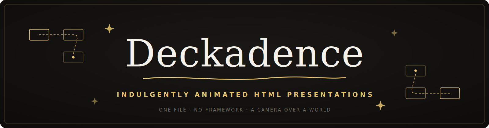

<p align="center">
  
</p>

<p align="center">
  <a href="https://tomacco.github.io/deckadence/"><b>✦ See the live demo — the landing page is itself a deck ✦</b></a>
</p>

---

**Deckadence** is a skill for [Claude Code](https://claude.com/claude-code) that turns
"make me slides" into a **cinematic, single-file HTML presentation**: stations placed on an
infinite 2D plane, a virtual camera that glides and dives between them, headings that rise
line by line, and SVG diagrams that draw themselves while you talk.

No PowerPoint. No framework. No build step. One HTML file you can open anywhere, present
from anywhere, and version like code.

It was built live for **[Rules, Not Vibes](https://tomacco.github.io/rules-not-vibes/)** —
a talk at the Claude event on June 10, 2026 — and gifted to the audience. Everything in
this skill was distilled from the craft (and the bugs) of making that deck real.

## What you get

- 🎥 **A camera over a world** — slides aren't pages, they're *places*. The camera pans,
  zooms, dives into full-screen websites, and can pull back to show the whole map (press `O`).
- ✍️ **Choreographed reveals** — weighty line-rise headings, staggered fades, scene
  controllers for multi-beat animated stations that cancel cleanly and replay on re-entry.
- 🖋 **Self-drawing SVG** — node graphs, flourishes, and diagrams that construct themselves
  in narrative order: stroke-draw wires, pulses flowing along paths, icons that beat.
- 🎨 **Brand-agnostic by design** — the engine never hardcodes a look. The skill asks for
  your design reference first; if you don't have one, it picks one of six curated
  directions (Brutalist, Editorial, Terminal, Swiss, Playful, Midnight Luxe) based on your
  audience and mood — and tells you why.
- ⌨️ **Presenter-grade navigation** — arrows/space, overview mode, clickable progress rail
  with tooltips, `#s5` deep links for rehearsal, plus a ready pattern for auto-playing
  reels the presenter can take over (they stop at the end — they never loop over you).
- 🪤 **The traps, pre-stepped-on** — mid-word line breaks, final-state flashes,
  reduced-motion killing the show, iframe `100vh` ballooning… eleven of them, documented,
  with the fixes baked in.

## Install

```bash
# macOS / Linux
git clone https://github.com/tomacco/deckadence ~/.claude/skills/deckadence

# Windows (PowerShell)
git clone https://github.com/tomacco/deckadence "$env:USERPROFILE\.claude\skills\deckadence"
```

That's it. Open Claude Code and ask:

> *"Make me a deck about how our migration actually went."*

Claude reads the skill, asks whether you have a design reference (your Figma is the
contract — that rule was earned painfully), structures your story into stations, and builds
the file.

## How it works

```
your story  ──▶  stations on an infinite plane  ──▶  a camera that flies
                 (1920×1080 frames, monotone          (anime.js v4 tweens one
                  down/right staircase)                {x, y, zoom} object)
```

Three moving parts, ~300 lines of engine, all in one file:

| Piece | What it does |
|---|---|
| `template/starter.html` | A complete working 6-station deck — engine, HUD, nav, one animated SVG scene. The starting point for every build. |
| `SKILL.md` | The workflow Claude follows: design direction → narrative → layout → animation → verification. |
| `references/` | The deep craft: engine internals, motion choreography, SVG recipes, the design-direction catalog, and the pitfalls list. |

## The rules it enforces

A few of the hard rules baked into the skill — each one paid for with a real bug or a real
ugly deck:

1. Every station gets a transition, even subtle. Never a bare cut.
2. One element owns each moment. If two things pulse, neither is the focus.
3. Headings split into **lines**, never characters (char-splitting breaks words mid-word).
4. Initial states are set **before** elements become visible — no final-state flash.
5. Motion is content: reduced-motion gets calmer timing, never a dead cut.
6. Auto-playing reels stop at the end. They never loop over the speaker.
7. One accent color, used deliberately.

## Try the template right now

```bash
# no install needed — it runs from a double-click (internet required: the starter
# loads anime.js + fonts from CDNs; vendor both before presenting for real)
open template/starter.html        # macOS
start template\starter.html       # Windows
```

`→` to advance · `O` for the overview · click the dots · add `#s3` to the URL to deep-link.

## Credits

Made by **[Ivan "Tomacco"](https://github.com/tomacco)** & **Claude**, on stage and behind
it. Born from *Rules, Not Vibes* (with **Laura "Rose Days"**) — a talk about why on-brand
isn't taste, it's rules a machine can follow. This skill is those rules, for presentations.

Animation by [anime.js v4](https://animejs.com). MIT licensed — take it, reskin it,
present something indecent.
